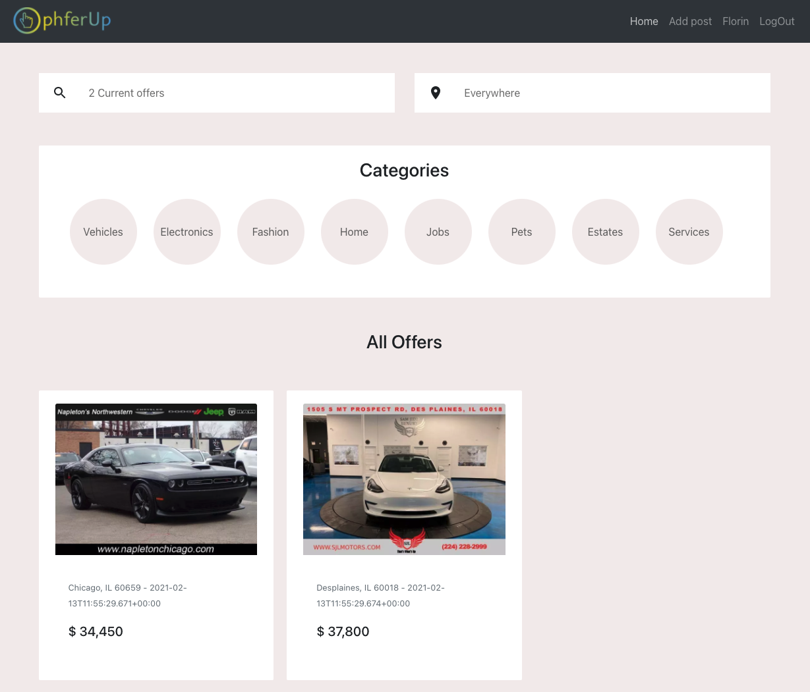
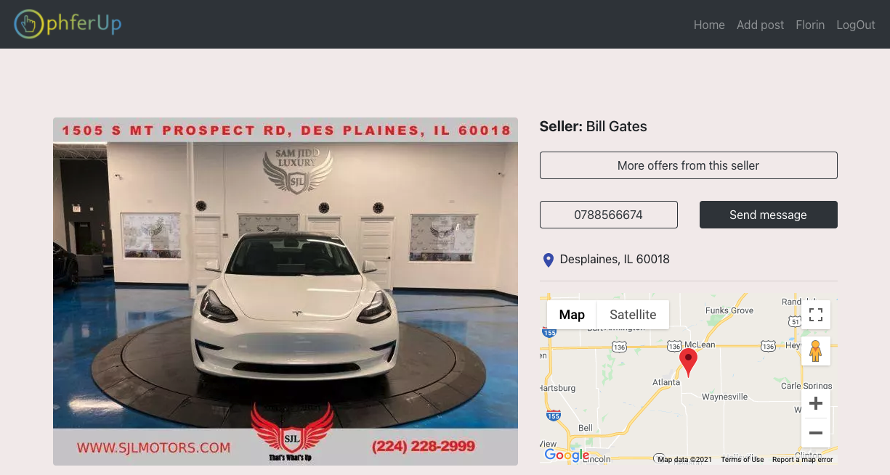
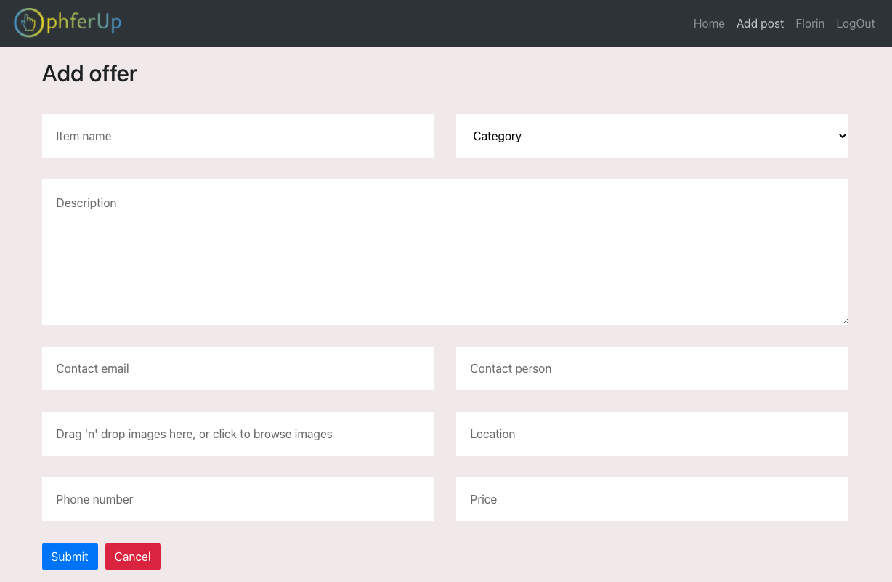
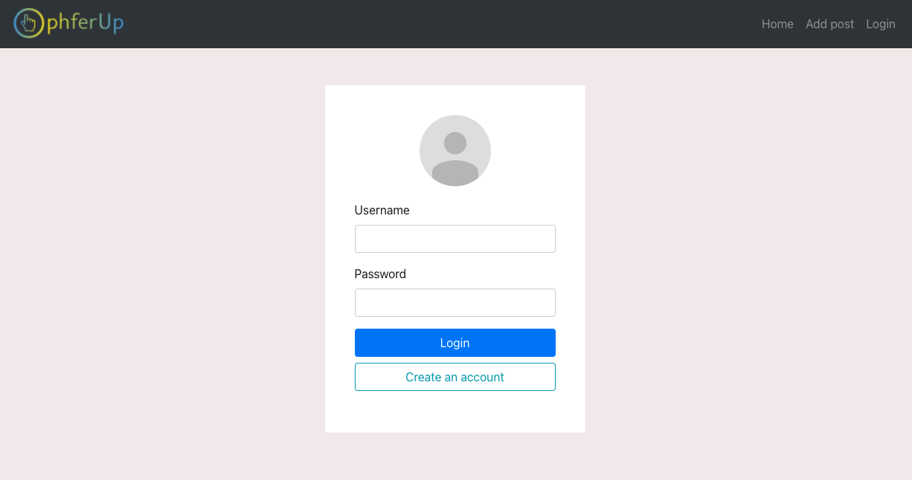

## OphferUp Frontend

    OphferUp it's a multi-client web application where users can register, sell/buy/donate all kind of
    goods and interact with each other.

    The frontend part of the app it's built in JavaScript. It uses React hooks for code reusability
    and readability, Axios for data manipulation, react-google-maps for google map integration,
    react-dropzone for image uploading and CSS - Bootstrap - Material UI for design.

    

    

   

    

    

 
